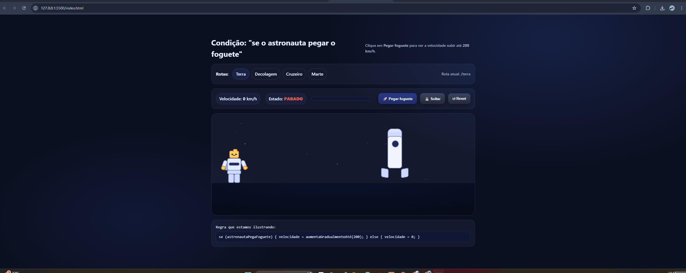

# 🚀 Astronauta LEGO Space Mission

Projeto interativo em HTML, CSS e JavaScript que simula uma missão espacial com um astronauta estilo LEGO.

O astronauta pode entrar no foguete, acelerar pelo espaço e viajar da Terra até Marte.

## 🎬 Demonstração

  

## 🛠 Tecnologias

- HTML
- CSS
- JavaScript

## 🎯 Objetivo

Demonstrar lógica condicional, animações, rotas em JavaScript (SPA) e simulação de endpoints de forma visual.
